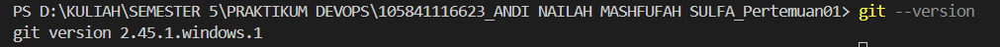
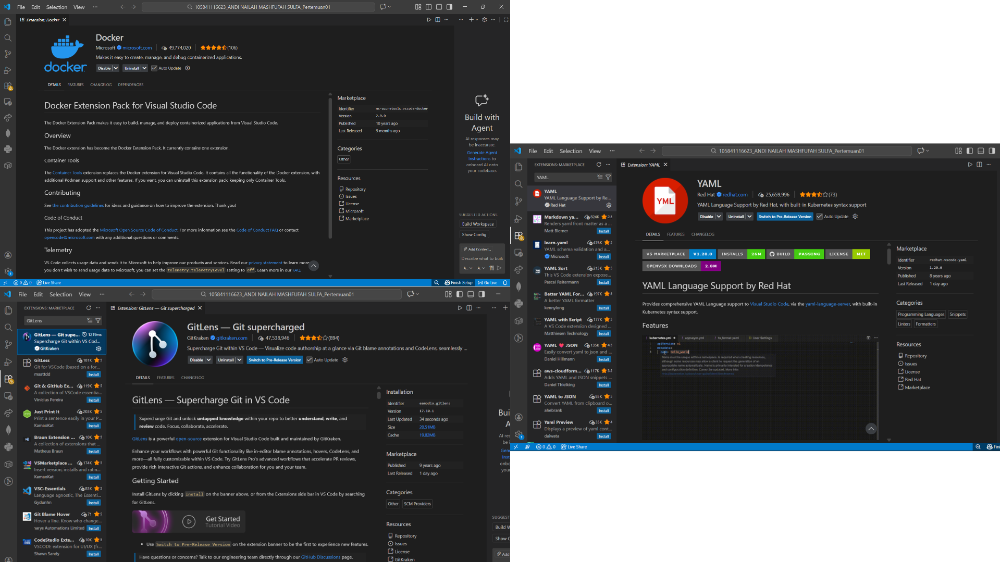

# Laporan Praktikum DevOps - Pertemuan 01

## Task 2: Dokumentasi

### Penjelasan DevOps
DevOps adalah kombinasi dari Development (pengembangan) dan Operations (operasional) yang bertujuan untuk mempercepat siklus pengiriman aplikasi dengan kualitas yang lebih stabil. DevOps bukan hanya sekadar penggunaan tools, melainkan sebuah budaya kerja yang menekankan kolaborasi, komunikasi, serta integrasi antara tim pengembang dan tim operasional agar proses pengembangan hingga distribusi aplikasi berjalan lebih efisien.

Sebelum konsep DevOps diterapkan, tim development dan operations sering bekerja secara terpisah. Developer berfokus pada pembuatan fitur dan perubahan kode, sementara tim operations bertanggung jawab terhadap deployment dan pemeliharaan sistem. Perbedaan fokus ini kerap menimbulkan keterlambatan rilis, miskomunikasi, hingga masalah stabilitas aplikasi di lingkungan produksi. DevOps hadir sebagai solusi dengan menyatukan kedua peran tersebut dalam satu alur kerja yang terintegrasi dan berkelanjutan.

Dalam penerapannya, DevOps menekankan otomatisasi pada proses build, testing, dan deployment sehingga kesalahan akibat campur tangan manual dapat diminimalkan. Konsep seperti Continuous Integration dan Continuous Delivery memungkinkan perubahan kode diuji dan dirilis dengan cepat serta konsisten. Berbagai tools sering digunakan untuk mendukung praktik ini, seperti Git untuk manajemen versi, Jenkins sebagai server otomatisasi, Docker untuk teknologi container, serta Kubernetes untuk pengelolaan container dalam skala besar.

Dengan pendekatan tersebut, DevOps membantu organisasi meningkatkan kualitas perangkat lunak, mempercepat waktu rilis, menjaga stabilitas sistem, serta memberikan respons yang lebih cepat terhadap kebutuhan pengguna dan perubahan teknologi.

### Mengapa DevOps Penting?
* **Otomatisasi**: Mempercepat proses deployment tanpa banyak campur tangan manual.
* **Konsistensi**: Menggunakan Docker memastikan aplikasi berjalan sama di semua environment.
* **Kolaborasi**: Meningkatkan efisiensi kerja antara tim developer dan tim IT support.

## Hasil Setup Environment

