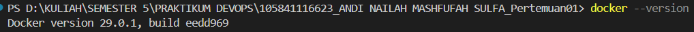

# Laporan Praktikum DevOps - Pertemuan 01

## Task 2: Dokumentasi

### Penjelasan DevOps
DevOps adalah kombinasi dari Development (pengembangan) dan Operations (operasional) yang bertujuan untuk mempercepat siklus pengiriman aplikasi dengan kualitas yang lebih stabil.

### Mengapa DevOps Penting?
* **Otomatisasi**: Mempercepat proses deployment tanpa banyak campur tangan manual.
* **Konsistensi**: Menggunakan Docker memastikan aplikasi berjalan sama di semua environment.
* **Kolaborasi**: Meningkatkan efisiensi kerja antara tim developer dan tim IT support.

## Hasil Setup Environment

