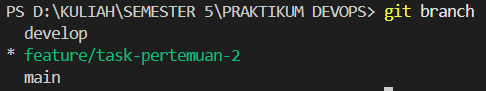

# Laporan Praktikum DevOps - Pertemuan 02

## Task 1: Implement GitFlow
Pada tugas ini, saya telah mengimplementasikan alur kerja GitFlow dengan langkah-langkah sebagai berikut:
1. **Initialize GitFlow**: Mengatur branch `main` untuk produksi dan `develop` untuk pengembangan.
2. **Feature Branch**: Membuat branch `feature/task-pertemuan-2` untuk mengerjakan fitur laporan.
3. **Commit & Merge**: Melakukan commit perubahan dan menggabungkannya kembali ke branch `develop` menggunakan perintah `git flow feature finish`.
4. **Release**: Membuat branch rilis untuk persiapan merge ke branch utama (`main`).

## Task 2: Resolve Merge Conflicts
Pada tugas ini, saya mensimulasikan terjadinya konflik antar branch dan menyelesaikannya secara manual:
1. **Create Conflict**: Membuat perubahan pada baris yang sama di branch `main` dan `develop`.
2. **Merge Trigger**: Menjalankan perintah `git merge main` saat berada di branch `develop` sehingga muncul status *Conflict*.
3. **Resolution**: Menggunakan fitur *Merge Editor* di VS Code untuk memilih perubahan yang ingin dipertahankan (*Accept Both Changes*).
4. **Final Commit**: Menyelesaikan proses merge dengan commit resolusi konflik.

**Bukti Branching:**
